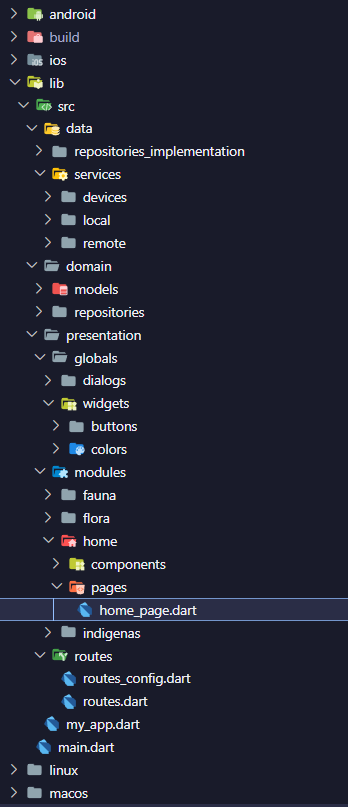

# Species flutter app

## Arquitectura de la aplicación

### Clean Architecture

La arquitectura de la aplicación es Clean Architecture, la cual se divide en tres capas:

- Capa de datos: Contiene la lógica de acceso a datos de la aplicación, como repositorios, fuentes de datos y modelos de datos.

- Capa de dominio: Contiene la lógica de negocio de la aplicación, como entidades y casos de uso.

- Capa de presentación: Contiene la lógica de presentación de la aplicación, como pantallas, widgets y lógica de presentación.

### Imagen de la estructura de la aplicación
<!-- imagen -->

- Carpeta "src": Contiene el código fuente de la aplicación.

  - Carpeta "data": Aquí se encuentra la capa de datos de la aplicación.
  - Carpeta "domain": Aquí se encuentra la capa de dominio de la aplicación.
  - Carpeta "presentation": Aquí se encuentra la capa de presentación de la aplicación.

- Carpeta "src/data":

  - Esta carpeta contiene los archivos relacionados con la capa de datos de la aplicación, como repositorios, fuentes de datos y modelos de datos.
    _ `repositories_implementation`: Contiene las implementaciones de los repositorios de la aplicación.
    _ `services`: Contiene los servicios de la aplicación.

- Carpeta "src/domain":

  - Esta carpeta contiene los archivos relacionados con la capa de dominio de la aplicación, como entidades y casos de uso.
    _ `models`: Contiene las entidades de la aplicación.
    _ `repositories`: Contiene los repositorios de la aplicación.

- Carpeta "src/presentation":
  - Esta carpeta contiene los archivos relacionados con la capa de presentación de la aplicación, como pantallas, widgets y lógica de presentación.
    _ `global`: Contiene los archivos globales de la aplicación. Como widgets que seran usados en toda la aplicación, el tema, el estilo de texto, etc. Las carpetas dentro de esta carpeta son:
        \_`dialogs`: Contiene los diálogos de la aplicación.
        \_`colors`: Contiene las constantes de la aplicación.
        \_`widgets`: Contiene los widgets de la aplicación.
    _ `views`: Contiene las pantallas de la aplicación.
    _ `routes`: Contiene las rutas de la aplicación.
    _ `my_app.dart`: Contiene el punto de entrada de la aplicación.
