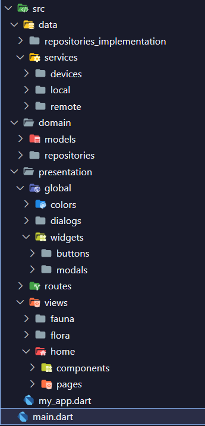

# Species flutter app

Aplicación móvil desarrollada en Flutter para la visualización de especies.

## Tabla de contenidos

- [Species flutter app](#species-flutter-app)
  - [Tabla de contenidos](#tabla-de-contenidos)
  - [Clean Architecture](#clean-architecture)
  - [Arquitectura de la aplicación](#arquitectura-de-la-aplicación)
    - [Imagen de la estructura de la aplicación](#imagen-de-la-estructura-de-la-aplicación)
    - [Descripción de las carpetas y archivos](#descripción-de-las-carpetas-y-archivos)

## Clean Architecture

La arquitectura de la aplicación es Clean Architecture, la cual se divide en tres capas:

- **Capa de datos**: Contiene la lógica de acceso a datos de la aplicación, como repositorios, fuentes de datos y modelos de datos.

- **Capa de dominio**: Contiene la lógica de negocio de la aplicación, como entidades y casos de uso.

- **Capa de presentación**: Contiene la lógica de presentación de la aplicación, como pantallas, widgets y lógica de presentación.

## Arquitectura de la aplicación
### Imagen de la estructura de la aplicación

### Descripción de las carpetas y archivos

- **Carpeta "src"**: Contiene el código fuente de la aplicación.

  - **Carpeta "data"**: Aquí se encuentra la capa de datos de la aplicación.
  - **Carpeta "domain"**: Aquí se encuentra la capa de dominio de la aplicación.
  - **Carpeta "presentation"**: Aquí se encuentra la capa de presentación de la aplicación.
  - **my_app.dart**: Contiene el punto de entrada de la aplicación.

- 📁 **Carpeta "src/data"**:

  - Esta carpeta contiene los archivos relacionados con la capa de datos de la aplicación, como repositorios, fuentes de datos y modelos de datos:
    - 💼 `repositories_implementation`: Contiene las implementaciones de los repositorios de la aplicación.
    - ⛽ `services`: Contiene los servicios de la aplicación.
        - 📁 `devices`: Contiene los servicios relacionados con el dispositivo.
        - 📁 `local`: Contiene los servicios relacionados con el cosumo local de datos (json, text, etc).
        - 📁 `remote`: Contiene los servicios relacionados con el cosumo remoto de datos (API's, Firebase, etc).

- 📁 **Carpeta "src/domain"**:

  - Esta carpeta contiene los archivos relacionados con la capa de dominio de la aplicación, como entidades y casos de uso.
    - 🏠 `models`: Contiene las entidades de la aplicación.
    - 💼 `repositories`: Contiene los repositorios de la aplicación.

- 📁 **Carpeta "src/presentation"**:
  - Esta carpeta contiene los archivos relacionados con la capa de presentación de la aplicación, como pantallas, widgets y lógica de presentación.
    - 🌎 `global`: Contiene los archivos globales de la aplicación. Como widgets que seran usados en toda la aplicación, el tema, el estilo de texto, etc. Las carpetas dentro de esta carpeta son:
        - `dialogs`: Contiene los diálogos de la aplicación.
        - `colors`: Contiene las constantes de la aplicación.
        - `widgets`: Contiene los widgets de la aplicación.
    - 💻 `views`: Contiene las pantallas de la aplicación.
    - 🛣️ `routes`: Contiene las rutas de la aplicación.
